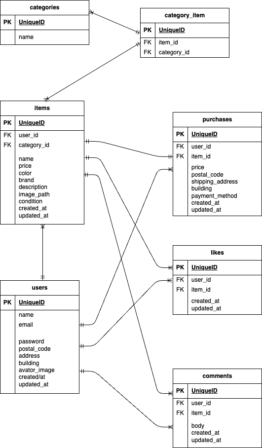

# coachtech_fleamarket

## Dockerビルド
  
git clone git@github.com:laughricotetsu/coachtech_fleamarket.git  
  
DockerDesktopアプリを立ち上げる  
docker-compose up -d --build  
  
MacのM1・M2チップのPCの場合、no matching manifest for linux/arm64/v8 in the manifest list entriesのメッセージが表示されビルドができないことがあります。 エラーが発生する場合は、docker-compose.ymlファイルの「mysql」内に「platform」の項目を追加で記載してください  
  
mysql:  
    platform: linux/x86_64  
    image: mysql:8.0.26  
    environment:  
  
  
## Laravel環境構築
  
docker-compose exec php bash  
composer install  
「.env.example」ファイルを 「.env」ファイルに命名を変更。または、新しく.envファイルを作成  
.envに以下の環境変数を追加  
DB_CONNECTION=mysql  
DB_HOST=mysql  
DB_PORT=3306  
DB_DATABASE=laravel_db  
DB_USERNAME=laravel_user  
DB_PASSWORD=laravel_pass  
  
アプリケーションキーの作成  
php artisan key:generate  
  
マイグレーションの実行  
php artisan migrate  
  
シーディングの実行  
php artisan db:seed  
  
シンボリックリンク作成  
php artisan storage:link  
  

## メール認証機能  
  
1. docker-compose.ymlを修正  
 services:  
 app:  
 mailhog:  
 image: mailhog/mailhog  
 container_name: mailhog  
 ports:  
 -"8025:8025"  
 -"1025:1025"  
  
2. config/fortify.phpの'features'の中の  
 //Features::registration(),  
 //Features::emailVerification(),  
 コメントアウトを消して有効化する。  
  
3. 起動  
 docker-compose up -d  
  
  
## Stripe設定  
  
 1. 「.env」ファイルに追記  
 STRIPE_KEY=pk_test_XXXXXXXXXX  
 STRIPE_SECRET=sk_test_XXXXXXXXX  
 (Xに値を設定してください)  
  
2. config/services.phpに追記  
 'stripe' => [
    'key' => env('STRIPE_KEY'),  
    'secret' => env('STRIPE_SECRET'),  
 ],  

## 使用技術(実行環境)  

PHP8.3.0  
Laravel8.83.27.  
MySQL8.0.26  
  
  
## ER図・データベース設計  
  
1. データベース設計概要  
本アプリケーションは、ユーザーが商品を出品・購入し、商品に対していいねやコメントを行えるフリマアプリです。  
それぞれの機能を適切に管理するため、正規化を意識したテーブル設計を行いました。  
  
2. ER図  
  
本アプリケーションの ER 図は以下のテーブルで構成されている。  
-users  
-items  
-categories  
-category_item（中間テーブル）  
-likes  
-comments  
-purchase  
  
items と categories は多対多の関係となるため、中間テーブルとして category_item を設けています。  
要件シートのテーブル仕様書にも詳細を記載しています。  
  
3. 各テーブルの役割  
users テーブル  
ユーザー情報を管理するテーブル。  
ログイン情報に加え、配送先住所やプロフィール画像を保持する。  
  
items テーブル  
ユーザーが出品した商品情報を管理するテーブル。  
1人のユーザーは複数の商品を出品できる。  
  
categories テーブル  
商品カテゴリを管理するマスタテーブル。  
  
category_item テーブル  
items と categories の多対多関係を管理する中間テーブル。  
  
likes テーブル  
ユーザーが商品に対して行った「いいね」を管理するテーブル。  
1人のユーザーは複数の商品にいいねをすることができる。  
  
comments テーブル  
商品に対するコメントを管理するテーブル。  
ユーザーと商品の紐づきを保持する。  
  
purchase テーブル  
商品の購入履歴を管理するテーブル。  
購入時点の価格・配送先住所・支払い方法を保持することで、後から情報が変更されても履歴として正しく残る設計としている。  
  
4. 設計の工夫点  
  
多対多関係は中間テーブルを用いて正規化した.  
purchase テーブルに住所情報を保持し、購入時点の情報を保存できるようにした.  
likes・comments を独立テーブルとすることで、将来的な機能拡張にも対応しやすい構成とした.  
Laravel の Eloquent リレーションと整合性の取れた設計としている.  
  
6. ER図  
  
  
  5. 使用技術

Laravel  
MySQL  
draw.io（ER図作成）  
  
## URL  
- 開発環境：http://localhost/
- phpMyAdmin:：http://localhost:8080/

